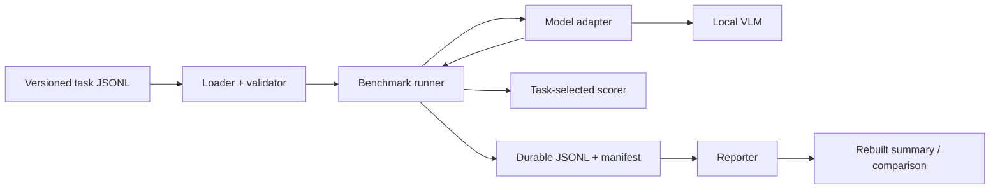

# OpenMultimodalLab

[](https://github.com/AlbertXXuu/OpenMultimodalLab/actions/workflows/ci.yml)

[](LICENSE)

[简体中文](README.zh-CN.md)

A local-first, reproducible benchmark toolkit for answering a practical
question: **which vision-language model works best for this task and this
hardware, and what evidence supports that choice?**

OpenMultimodalLab runs versioned multimodal tasks through interchangeable model
adapters, preserves every output and failure as JSONL, applies deterministic
task-selected scoring, and records enough configuration and environment data
to rebuild a report without rerunning the model.

> Status: technically release-ready v1.0.0 candidate. Both pinned models have
> completed the same formal 102-task image, document, short-video, and
> robustness grid. Raw results, deterministic reports, video demo, license and
> security audits, Python 3.11/3.13 checks, fresh Windows wheel verification,
> and GitHub Linux CI evidence are preserved. The repository remains private;
> public visibility and the formal Release are separate owner decisions.

## v1.0.0 candidate comparison

One NVIDIA RTX 4060 Laptop GPU (8,188 MiB), the same 102 human-checked tasks,
one warm-up, three complete measured repetitions, greedy decoding, batch size
1, and one clean Git commit:

| Model | Mean task score | Median TTFT | Median task latency | Peak allocated GPU memory | Runtime failures |
|---|---:|---:|---:|---:|---:|
| Qwen3-VL-2B | 0.784 | 120.5 ms | 212.9 ms | 4,180.5 MiB | 0/306 |
| SmolVLM2-500M | 0.690 | 260.0 ms | 471.5 ms | 1,265.3 MiB | 0/306 |

Qwen achieved the higher aggregate score and lower median latency. SmolVLM2
used about 70% less peak allocated GPU memory and led some categories,
including OCR and event order. This is an evidence-backed hardware/task
trade-off, not a universal model ranking; all media are controlled synthetic
assets and cross-family token throughput is not directly equivalent.


Read the [byte-rebuildable report](docs/reports/v1.0.0-candidate/report.md) or
inspect the preserved
[Qwen JSONL](docs/reports/results/2026-08-10-qwen3-vl-v1.0.0-formal.jsonl),
[SmolVLM2 JSONL](docs/reports/results/2026-08-10-smolvlm2-v1.0.0-formal.jsonl),
and their SHA-bound manifests. Historical ten-task and document-only reports
remain available in the evidence index below.

## Short-video demo


This is a deliberately non-cherry-picked temporal-position example from the
formal grid: Qwen answered the final position correctly in all three measured
repetitions, while SmolVLM2 failed all three. The
[copyable video tutorial](docs/tutorials/video-benchmark.md) connects this GIF
to the exact task, commands, raw records, and deterministic rebuild script.

## What is already implemented

- A dependency-free core and deterministic `mock` backend for offline CI.
- Real, lazy-loaded Qwen3-VL-2B and SmolVLM2-500M Transformers backends.
- Immutable model revisions and native processor/chat-template metadata.
- Versioned UTF-8 JSONL tasks with validation and licensed generated media.
- Exact-match, numeric-tolerance, keyword-coverage, and ordered/unordered
  attribute-group scoring through backward-compatible task schemas 1.0–1.2.
- `synthetic-docs-v1`: 32 licensed tasks over eight reproducible OCR,
  key-value, table, bar-chart, and line-chart images.
- `synthetic-video-v1`: 24 owner-reviewed tasks over eight deterministic,
  project-generated short videos.
- `synthetic-robustness-v1`: 36 owner-reviewed tasks covering small objects,
  low contrast, visual clutter, and partial occlusion.
- A shared local-video path for both real backends: PyAV decoding, eight
  uniformly sampled frames, preserved sampling metadata, and no hidden
  processor resampling.
- Warm-up plus repeated measurement with CUDA-synchronized TTFT, generation
  time, throughput, preprocessing time, and peak allocated memory.
- A deterministic multi-model report-bundle builder that rejects incomplete
  formal grids and emits Markdown, CSV, failure data, SVG, and a self-hashed
  build manifest from preserved JSONL without rerunning a model.
- Typed model-load, timeout, out-of-memory, generation, and evaluation failures.
- Run record schema 0.4 with durable invocation indexes, terminal/retryable
  state, cumulative latency, retry policy, and cooperative deadlines.
- Strict `--resume`, explicit `--overwrite`, output SHA-256, and atomic
  per-record checkpoints.
- Backend-aware `doctor` checks for Python, CUDA, BF16, optional packages, and
  available working/model-cache disk without printing the cache path.
- Bounded local input parsing for dataset/result JSONL, images, and short video,
  plus portable media references and path-redacted durable errors.
- Python 3.11/3.12 Linux CI, wheel builds, link/JSON/privacy checks, and
  an offline test suite.

## Architecture



Inference and reporting are deliberately separate. Charts and summaries are
derived artifacts; raw task-level evidence remains the source of truth.

For release-grade reconstruction, the
[deterministic report-bundle workflow](docs/report-bundles.md) validates exact
one-warm-up/three-repeat grids, source manifests, model and dataset identities,
and dataset/media hashes before generating a complete comparison bundle. The
committed [v1.0.0 candidate report](docs/reports/v1.0.0-candidate/report.md)
applies that path to the complete 102-task, two-model formal grid. The older
[rebuilt baseline](docs/reports/rebuilt-baseline/report.md) remains available
for historical auditability.

## Five-minute core quick start

The core path does not download a model and works on Python 3.11, 3.12, or
3.13. The primary examples use Windows PowerShell:

```powershell
git clone https://github.com/AlbertXXuu/OpenMultimodalLab.git
cd OpenMultimodalLab

py -3.11 -m venv .venv
.\.venv\Scripts\python.exe -m pip install -e .

.\.venv\Scripts\oml.exe doctor
.\.venv\Scripts\oml.exe run `
  --dataset examples/tasks/smoke.jsonl `
  --output runs/smoke-001.jsonl
.\.venv\Scripts\oml.exe report `
  --input runs/smoke-001.jsonl
.\.venv\Scripts\python.exe -m unittest discover -s tests -v
```

Linux uses the same CLI arguments with POSIX environment paths:

```bash
python3.11 -m venv .venv
.venv/bin/python -m pip install -e .
.venv/bin/oml doctor
.venv/bin/oml run \
  --dataset examples/tasks/smoke.jsonl \
  --output runs/smoke-001.jsonl
.venv/bin/oml report --input runs/smoke-001.jsonl
.venv/bin/python -m unittest discover -s tests -v
```

The `mock` backend verifies infrastructure only. Do not use its score as a
model-quality result.

## Run a real local model

Use a separate Python 3.11 or 3.12 environment. Install a CUDA-enabled PyTorch
build appropriate for your platform before the project extra; `doctor`
detects a CPU-only mismatch when an NVIDIA GPU is visible.

- [Qwen3-VL installation and verified Windows profile](docs/backends/qwen3-vl.md)
- [SmolVLM2 installation and verified profile](docs/backends/smolvlm2.md)

Example after the Qwen environment is ready:

```powershell
.\.venv-ml\Scripts\oml.exe doctor --backend qwen3-vl

.\.venv-ml\Scripts\oml.exe run `
  --backend qwen3-vl `
  --dataset examples/tasks/synthetic-v1.1.jsonl `
  --warmup 1 `
  --repetitions 3 `
  --max-new-tokens 64 `
  --output runs/qwen3-vl-formal-001.jsonl
```

The first real run downloads the pinned model into the Hugging Face user
cache. Model weights and raw `runs/` outputs are excluded from Git.

## Safe output and recovery

`oml run` refuses to replace an existing output or manifest. After a compatible
interruption, repeat the exact command with `--resume`:

```powershell
.\.venv-ml\Scripts\oml.exe run `
  --backend qwen3-vl `
  --dataset examples/tasks/synthetic-v1.1.jsonl `
  --warmup 1 `
  --repetitions 3 `
  --max-new-tokens 64 `
  --output runs/qwen3-vl-formal-001.jsonl `
  --resume
```

Resume verifies dataset/media hashes, tasks and order, model revision,
generation settings, environment, Git state, output hash and size, record
count, and the exact attempt prefix before appending anything. Use
`--overwrite` only when replacing the old evidence is intentional.

See the [strict resume report](docs/reports/2026-07-31-resumable-runs.md) for
the crash-consistency model and failure-injection evidence.

For long local runs, bounded retry and timeout policy is explicit:

```powershell
.\.venv-ml\Scripts\oml.exe run `
  --backend qwen3-vl `
  --dataset examples/tasks/synthetic-docs-v1.jsonl `
  --attempt-timeout-seconds 120 `
  --max-retries 1 `
  --output runs/qwen3-vl-docs-001.jsonl
```

Retries apply only to `timeout` and `generation_error`; invalid input, model
load failure, and out-of-memory are terminal. Built-in model deadlines are
cooperative and begin after one-time model loading. They can bound preprocessing
and Transformers generation, but cannot safely preempt a running CUDA kernel.

## Reproducibility contract

A publishable run should:

1. use immutable task and model revisions;
2. preserve the stored prompts and semantic media;
3. use deterministic decoding and batch size 1;
4. perform exactly one warm-up and three complete measured repetitions;
5. retain slow attempts and failures;
6. publish raw JSONL, the manifest, metric definitions, and limitations.

The [evaluation protocol](docs/evaluation-protocol.md) defines timing and
comparison boundaries. Cross-model token throughput is not treated as directly
equivalent because tokenizers differ.

## Evidence and documentation

| Topic | Document |
|---|---|
| Project objective and acceptance criteria | [Goals and success](docs/01-goals-and-success.md) |
| Scope and requirements | [Scope](docs/02-scope-and-requirements.md) |
| System design | [Architecture](docs/03-architecture.md) |
| Experiment rules | [Evaluation protocol](docs/evaluation-protocol.md) |
| Run records, manifests, and resume | [Artifact contract](docs/run-records-and-manifests.md) |
| Two-model formal result | [Qwen3-VL vs SmolVLM2](docs/reports/2026-07-31-qwen3-vl-vs-smolvlm2.md) |
| 32-task document comparison | [Qwen3-VL vs SmolVLM2 on documents](docs/reports/2026-08-02-document-model-comparison.md) |
| 102-task v1.0.0 candidate comparison | [Byte-rebuildable final-corpus bundle](docs/reports/v1.0.0-candidate/report.md) |
| Performance methodology | [Qwen formal performance baseline](docs/reports/2026-07-31-qwen3-vl-formal-performance.md) |
| Quality and public-release gates | [Quality standard](docs/06-quality-and-open-source.md) |
| Live public-release status | [Evidence matrix and strict readiness check](docs/public-release-readiness.md) |
| Real short-video runtime smoke | [Two-backend Windows GPU evidence](docs/reports/2026-08-02-video-runtime-smoke.md) |
| Short-video corpus tooling | [Deterministic generation and human-review workflow](docs/video-corpus-tooling.md) |
| Short-video demonstration | [Copyable benchmark and evidence-built GIF](docs/tutorials/video-benchmark.md) |
| Visual-robustness corpus tooling | [Four-factor deterministic draft and review workflow](docs/robustness-corpus-tooling.md) |
| Fresh wheel installation | [Windows audit and permanent CI gate](docs/reports/2026-08-01-fresh-wheel-install.md) |
| Dependency supply chain | [Action pinning and update audit](docs/reports/2026-08-01-supply-chain-audit.md) |
| Security review | [Bounded local-input and privacy audit](docs/reports/2026-08-02-security-review.md) |
| Final security evidence | [Bandit, dependency advisories, and residual risks](docs/reports/final-security-review.md) |
| Final release validation | [Python, Windows, wheel, report, and CI evidence](docs/reports/final-candidate-validation.md) |
| Final Linux CI | [Recorded successful GitHub Actions run](docs/reports/final-linux-ci-validation.md) |
| Document/table/chart task set | [`synthetic-docs-v1` evidence report](docs/reports/2026-08-01-synthetic-docs-v1.md) |
| Timeout and retry provenance | [Run record schema 0.4 report](docs/reports/2026-08-01-run-record-0.4.md) |
| First complete experiment | [Step-by-step tutorial](docs/tutorials/first-reproducible-benchmark.md) |
| Current work | [Task board](TASKS.md) |
| Third-party licenses | [Third-party notices](THIRD_PARTY_NOTICES.md) |
| Reproducible license audit | [Package, model, PyAV, and FFmpeg policy](docs/license-audit.md) |
| Final dependency/license audit | [Clean snapshot, exact constraints, and distribution boundary](docs/reports/final-dependency-license-audit.md) |

## Project status

| Area | Current state |
|---|---|
| Real image backends | Qwen3-VL-2B and SmolVLM2-500M verified locally |
| Current versioned task corpus | 102 licensed, human-checked image, document, short-video, and robustness tasks |
| Preserved real-model comparison | Both pinned models, 102 tasks, 1 warm-up + 3 repetitions, 612 measured attempts |
| Performance protocol | Warm-up, three repetitions, TTFT, throughput, latency, peak memory |
| Reliability | Durable records, strict resume, integrity hashes, typed failures |
| Automated quality | Python 3.11/3.12 Linux CI, local 3.11/3.13 tests, repository audit, fresh Windows wheel smoke |
| Remaining release action | Owner decision on public visibility, followed separately by the formal Release |

The target of at least 100 human-checked tasks is complete. Repository
publication and a formal Release remain separate owner-authorized actions.

## Contributing

Small, testable contributions that improve reproducibility are welcome.
Before proposing another model, include its exact revision, license,
installation path, verified hardware, adapter contract tests, and known
limitations.

```powershell
.\.venv\Scripts\python.exe -m unittest discover -s tests -v
.\.venv\Scripts\python.exe scripts/check_repository.py
.\.venv\Scripts\python.exe scripts/check_release_readiness.py
```

Read [CONTRIBUTING.md](CONTRIBUTING.md) for the full checklist.
Sensitive vulnerabilities follow [SECURITY.md](SECURITY.md), not a public bug
report.

## License

Project code and project-generated synthetic media use Apache-2.0. Model
weights and optional runtime dependencies retain their own licenses and are
not distributed in this repository. See [THIRD_PARTY_NOTICES.md](THIRD_PARTY_NOTICES.md).

This project does not promise a Star count or present planned users as real
adoption. Reproducible evidence, usable documentation, and external feedback
are the measures that matter.
