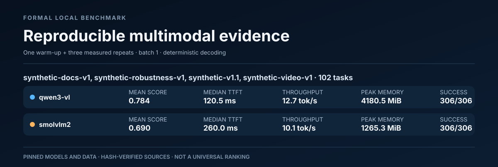
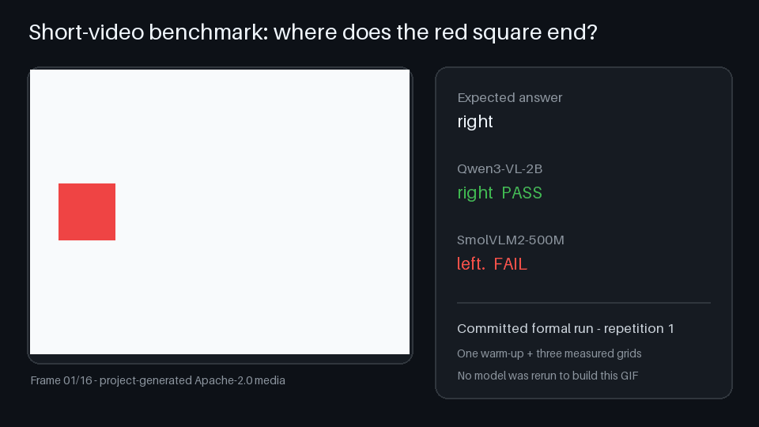
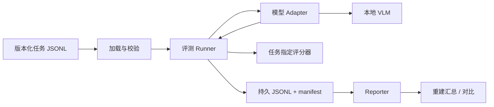

<p align="center">
  
</p>

# Ailumetra

**OpenMultimodalLab 是 Ailumetra 背后的开源评测引擎。**

[](https://github.com/AlbertXXuu/OpenMultimodalLab/actions/workflows/ci.yml)

[](LICENSE)

[English](README.md)

一个本地优先、强调可复现证据的多模态模型评测工具。它要回答的不是“哪个
模型最热门”，而是：**在这组任务和这台硬件上，哪个视觉语言模型更合适，
这个结论能否被复核？**

OpenMultimodalLab 用统一 Adapter 运行版本化任务，把每次输出和失败写入
JSONL，按任务选择确定性评分规则，并记录模型、环境、输入哈希和性能边界，
从而不用重新推理也能重建报告。

> OpenMultimodalLab v1.0.0 是首个公开正式版。两个固定模型已经完成同一套 102
> 条图片、文档、短视频和鲁棒性任务的正式网格；原始结果、确定性报告、视频
> 演示、许可证与安全审计、Python 3.11/3.13、全新 Windows wheel 和 GitHub
> Linux CI 证据均已保存。仓库和正式
> [v1.0.0 GitHub Release](https://github.com/AlbertXXuu/OpenMultimodalLab/releases/tag/v1.0.0)
> 已于 2026-08-10 经所有者明确授权发布。

## v1.0.0 正式基准对比

硬件为 NVIDIA RTX 4060 Laptop GPU（8,188 MiB）。两个模型使用相同的 102
条人工检查任务、相同干净 Git 提交、1 次 warm-up、3 次完整正式重复、贪心
解码和 batch size 1：

| 模型 | 平均任务得分 | 中位 TTFT | 中位任务延迟 | 峰值已分配显存 | 运行失败 |
|---|---:|---:|---:|---:|---:|
| Qwen3-VL-2B | 0.784 | 120.5 ms | 212.9 ms | 4,180.5 MiB | 0/306 |
| SmolVLM2-500M | 0.690 | 260.0 ms | 471.5 ms | 1,265.3 MiB | 0/306 |

Qwen 的总体得分更高、中位延迟更低；SmolVLM2 的峰值显存约低 70%，并在
OCR、事件顺序等部分分类领先。这是基于固定硬件和任务的取舍证据，不是通用
排行榜；媒体均为受控合成资产，不同 tokenizer 的吞吐也不能直接等价比较。



完整证据见[可逐字节重建报告](docs/reports/v1.0.0-candidate/report.md)，原始
[Qwen JSONL](docs/reports/results/2026-08-10-qwen3-vl-v1.0.0-formal.jsonl)、
[SmolVLM2 JSONL](docs/reports/results/2026-08-10-smolvlm2-v1.0.0-formal.jsonl)
及其 SHA 绑定 manifest 均已保存。早期 10 条任务和文档专项报告仍保留在下方
证据索引中供审计。

## 短视频演示



这个时序位置样例没有隐藏失败：Qwen 在三次正式重复中都正确判断了最终位置，
SmolVLM2 则三次都失败。[可复制的视频教程](docs/tutorials/video-benchmark.md)
把动画与原始任务、运行命令、JSONL 记录和确定性重建脚本对应起来。

## 已实现能力

- 零第三方依赖核心和用于离线 CI 的确定性 `mock` 后端。
- Qwen3-VL-2B 与 SmolVLM2-500M 两个真实 Transformers 后端。
- 固定模型 revision，并记录原生 processor 与 chat template。
- 严格校验的版本化 UTF-8 JSONL 任务和许可证清晰的生成媒体。
- 通过向后兼容的任务 Schema 1.0–1.2 支持精确匹配、数值容差、关键词覆盖
  和可排序属性组评分。
- `synthetic-docs-v1`：32 条许可证清晰的任务，覆盖 8 张可复现生成的 OCR、
  键值、表格、柱状图和折线图图片。
- `synthetic-video-v1`：24 条经所有者复核的任务，覆盖 8 个确定性生成短视频。
- `synthetic-robustness-v1`：36 条经所有者复核的小目标、低对比度、视觉干扰
  和局部遮挡任务。
- 两个真实后端共用本地视频链路：PyAV 解码、均匀抽取 8 帧、保留抽样元数据，
  并禁止 Processor 隐式二次抽帧。
- warm-up、重复测量、CUDA 同步 TTFT、生成速度、预处理和峰值显存。
- 确定性的多模型报告包生成器：拒绝不完整的正式重复网格，并从已保存 JSONL
  生成 Markdown、CSV、完整失败数据、SVG 和自哈希构建清单，无需重新运行模型。
- 可区分的模型加载、超时、OOM、生成和评分失败。
- Run record schema 0.4 持久化调用序号、终止/可重试状态、累计延迟、重试策略
  和协作式截止时间。
- 严格 `--resume`、显式 `--overwrite`、SHA-256 和原子检查点。
- 后端感知 `doctor` 检查 Python、CUDA、BF16、可选包和工作/模型缓存磁盘
  空间，但不打印缓存路径。
- 对任务/结果 JSONL、图片和短视频设置本地输入上限，并在持久化错误中使用
  可移植媒体引用和路径脱敏。
- Python 3.11/3.12 Linux CI、wheel 构建、仓库审计和离线测试集。

## 架构



推理与报告严格分离。图表和汇总是派生产物，逐任务原始证据才是事实来源。

面向发布的重建流程见[确定性报告包说明](docs/report-bundles.md)。它会先验证
“恰好一次 warm-up + 三次完整重复”、来源 manifest、模型/数据集身份和媒体哈希，
再生成完整对比包。仓库中的
[v1.0.0 正式报告](docs/reports/v1.0.0-candidate/report.md)已经覆盖完整的
102 条任务双模型正式网格；旧的
[重建基线](docs/reports/rebuilt-baseline/report.md)仅作为历史审计证据保留。

## 五分钟核心快速开始

核心路径不会下载模型，可在 Python 3.11、3.12 或 3.13 运行：

```powershell
git clone https://github.com/AlbertXXuu/OpenMultimodalLab.git
cd OpenMultimodalLab

py -3.11 -m venv .venv
.\.venv\Scripts\python.exe -m pip install -e .

.\.venv\Scripts\oml.exe doctor
.\.venv\Scripts\oml.exe run `
  --dataset examples/tasks/smoke.jsonl `
  --output runs/smoke-001.jsonl
.\.venv\Scripts\oml.exe report `
  --input runs/smoke-001.jsonl
.\.venv\Scripts\python.exe -m unittest discover -s tests -v
```

Linux 使用同一组 CLI 参数，只需改为 `.venv/bin/python` 和
`.venv/bin/oml`。

`mock` 只验证基础设施，不能用它的得分描述真实模型能力。

## Ailumetra Studio

Ailumetra Studio 是不改变可复现 CLI 流程的可选本地界面。它提供单输入模型
Playground 和只读报告浏览器，同时严格区分试玩结果与正式评测证据。
请在已经配置好真实模型的 Python 3.11/3.12 环境中运行；`studio` extra 只安装
界面，不会替你安装所选模型后端或支持 CUDA 的 PyTorch。

```powershell
.\.venv-ml\Scripts\python.exe -m pip install -e ".[studio]"
.\.venv-ml\Scripts\oml.exe doctor --backend qwen3-vl
.\.venv-ml\Scripts\oml.exe studio
```

Studio 只监听 `127.0.0.1`，关闭公开分享和分析，并把模型调用串行化以适配
8 GB 显卡。Playground 回答明确不评分；需要可保存、可比较的证据时仍使用
`oml run`。完整使用方法和安全边界见 [Studio 说明](docs/ailumetra-studio.md)。

## 运行真实本地模型

真实模型建议使用独立 Python 3.11/3.12 环境。先按硬件安装 CUDA 版
PyTorch，再安装项目 extra；当系统能看到 NVIDIA GPU 但 PyTorch 是 CPU
版本时，`doctor` 会明确拒绝。

- [Qwen3-VL 安装和已验证 Windows 配置](docs/backends/qwen3-vl.md)
- [SmolVLM2 安装和已验证配置](docs/backends/smolvlm2.md)

Qwen 环境准备完成后的正式命令：

```powershell
.\.venv-ml\Scripts\oml.exe doctor --backend qwen3-vl

.\.venv-ml\Scripts\oml.exe run `
  --backend qwen3-vl `
  --dataset examples/tasks/synthetic-v1.1.jsonl `
  --warmup 1 `
  --repetitions 3 `
  --max-new-tokens 64 `
  --output runs/qwen3-vl-formal-001.jsonl
```

首次运行会把固定 revision 的模型下载到 Hugging Face 用户缓存；权重和
本地 `runs/` 不进入 Git。

## 安全输出与中断恢复

`oml run` 默认拒绝覆盖已有 JSONL 或 manifest。兼容运行中断后，重复原命令
并加 `--resume`：

```powershell
.\.venv-ml\Scripts\oml.exe run `
  --backend qwen3-vl `
  --dataset examples/tasks/synthetic-v1.1.jsonl `
  --warmup 1 `
  --repetitions 3 `
  --max-new-tokens 64 `
  --output runs/qwen3-vl-formal-001.jsonl `
  --resume
```

追加前会核对数据/媒体哈希、任务顺序、模型 revision、生成参数、环境、
Git 状态、输出哈希与大小、记录数和严格尝试前缀。只有明确要替换旧证据时
才使用 `--overwrite`。

[严格恢复报告](docs/reports/2026-07-31-resumable-runs.md)说明了崩溃一致性
边界和故障注入证据。

长时间本地运行可以显式设置有限重试和超时策略：

```powershell
.\.venv-ml\Scripts\oml.exe run `
  --backend qwen3-vl `
  --dataset examples/tasks/synthetic-docs-v1.jsonl `
  --attempt-timeout-seconds 120 `
  --max-retries 1 `
  --output runs/qwen3-vl-docs-001.jsonl
```

只有 `timeout` 与 `generation_error` 会重试；输入错误、模型加载失败和 OOM
直接终止。内置模型的截止时间是协作式的，从一次性模型加载完成后开始计算；
它能约束预处理与 Transformers 生成，但不能安全地强制中断正在运行的 CUDA
内核。

## 可复现协议

可发布实验必须：

1. 固定任务和模型 revision；
2. 保留原 prompt 和语义一致的媒体；
3. 使用确定性解码和 batch size 1；
4. 恰好 1 次 warm-up、3 次完整正式重复；
5. 不删除慢样本或失败样本；
6. 发布原始 JSONL、manifest、指标定义和限制。

[评测协议](docs/evaluation-protocol.md)给出计时与比较边界。不同 tokenizer
的 token/s 不被假装成完全等价指标。

## 证据与文档

| 主题 | 文档 |
|---|---|
| 项目目标和验收标准 | [目标](docs/01-goals-and-success.md) |
| 范围和需求 | [范围](docs/02-scope-and-requirements.md) |
| 系统设计 | [架构](docs/03-architecture.md) |
| 实验规则 | [评测协议](docs/evaluation-protocol.md) |
| 运行记录、manifest 和恢复 | [产物契约](docs/run-records-and-manifests.md) |
| 双模型正式结果 | [Qwen3-VL vs SmolVLM2](docs/reports/2026-07-31-qwen3-vl-vs-smolvlm2.md) |
| 32 条文档任务对比 | [Qwen3-VL 与 SmolVLM2 文档评测](docs/reports/2026-08-02-document-model-comparison.md) |
| 102 条 v1.0.0 正式对比 | [可逐字节重建的完整语料报告](docs/reports/v1.0.0-candidate/report.md) |
| 性能方法 | [Qwen 正式性能基线](docs/reports/2026-07-31-qwen3-vl-formal-performance.md) |
| 质量与公开门槛 | [质量标准](docs/06-quality-and-open-source.md) |
| 实时公开准备状态 | [证据矩阵与严格验收命令](docs/public-release-readiness.md) |
| 真实短视频运行冒烟 | [两个后端的 Windows GPU 证据](docs/reports/2026-08-02-video-runtime-smoke.md) |
| 短视频语料工具链 | [确定性生成与人工复核流程](docs/video-corpus-tooling.md) |
| 短视频演示 | [可复制评测与证据生成 GIF](docs/tutorials/video-benchmark.md) |
| 视觉鲁棒性语料工具链 | [四类压力因素与人工复核流程](docs/robustness-corpus-tooling.md) |
| 全新 wheel 安装 | [Windows 审计与永久 CI 门禁](docs/reports/2026-08-01-fresh-wheel-install.md) |
| 依赖供应链 | [Action 固定与更新审计](docs/reports/2026-08-01-supply-chain-audit.md) |
| 可复现许可证审计 | [Python 包、模型、PyAV 与 FFmpeg 策略](docs/license-audit.md) |
| 安全审查 | [本地输入边界与路径隐私审计](docs/reports/2026-08-02-security-review.md) |
| 最终安全证据 | [Bandit、依赖漏洞与剩余风险](docs/reports/final-security-review.md) |
| 最终发布验证 | [Python、Windows、wheel、报告与 CI 证据](docs/reports/final-candidate-validation.md) |
| 最终 Linux CI | [已记录的 GitHub Actions 成功运行](docs/reports/final-linux-ci-validation.md) |
| 文档、表格与图表任务集 | [`synthetic-docs-v1` 证据报告](docs/reports/2026-08-01-synthetic-docs-v1.md) |
| 超时与重试溯源 | [Run record schema 0.4 报告](docs/reports/2026-08-01-run-record-0.4.md) |
| 第一份完整实验 | [分步教程（英文）](docs/tutorials/first-reproducible-benchmark.md) |
| 当前工作 | [任务清单](TASKS.md) |
| v1 之后的方向 | [证据驱动的维护路线图（英文）](docs/post-v1-roadmap.md) |
| 第三方许可证 | [Third-party notices](THIRD_PARTY_NOTICES.md) |
| 最终依赖与许可证审计 | [干净快照、精确约束与分发边界](docs/reports/final-dependency-license-audit.md) |

## 当前状态

| 领域 | 当前事实 |
|---|---|
| 真实图片后端 | Qwen3-VL-2B、SmolVLM2-500M 已在本机验证 |
| 当前版本化任务集 | 102 条经人工检查的图片、文档、短视频和鲁棒性任务 |
| 已保存真实模型对比 | 两个固定模型、102 条任务、1 次 warm-up、3 次重复、612 次正式测量 |
| 性能协议 | warm-up、三次重复、TTFT、吞吐、延迟、峰值显存 |
| 可靠性 | 逐条持久化、严格恢复、完整性哈希、失败分类 |
| 自动质量 | Python 3.11/3.12 Linux CI、本地 3.11/3.13、仓库审计、全新 Windows wheel 冒烟 |
| 发布状态 | 公开仓库与正式 `v1.0.0` GitHub Release |

至少 100 条人工检查任务的目标已经完成，仓库与正式 `v1.0.0` Release 均已
公开。未来版本必须重新完成同样的证据与授权流程，不得原地修改本次发布。

## 为什么值得持续关注

v1 之后只推进现有证据还不能回答的问题：非作者首次使用是否顺畅、产物校验
是否足够严格，以及新的低显存对比能否回答一个明确问题。新增 Adapter 必须
同时提供固定 revision、许可证证据、契约测试和独立研究问题。
[维护路线图](docs/post-v1-roadmap.md)明确区分已测结果与未来目标，也规定何时
应该拒绝无意义扩张。

## 贡献

优先接受小型、可测试、能改善可复现性的贡献。新增模型时需要提供精确
revision、许可证、安装路径、已验证硬件、Adapter 契约测试和限制。

```powershell
.\.venv\Scripts\python.exe -m unittest discover -s tests -v
.\.venv\Scripts\python.exe scripts/check_repository.py
.\.venv\Scripts\python.exe scripts/check_release_readiness.py
```

完整要求见 [CONTRIBUTING.md](CONTRIBUTING.md)。
安全漏洞按 [SECURITY.md](SECURITY.md) 建立私密渠道，不在公开 Bug 中粘贴
敏感细节。

## 许可证

项目代码和项目生成合成媒体采用 Apache-2.0。模型权重和可选运行依赖保留
各自许可证，不在本仓库分发。详见
[THIRD_PARTY_NOTICES.md](THIRD_PARTY_NOTICES.md)。

项目不承诺 Star 数，也不会把计划中的用户写成真实采用。可复现证据、可用
文档和外部反馈才是有效指标。
