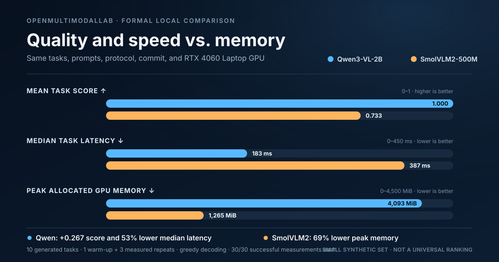
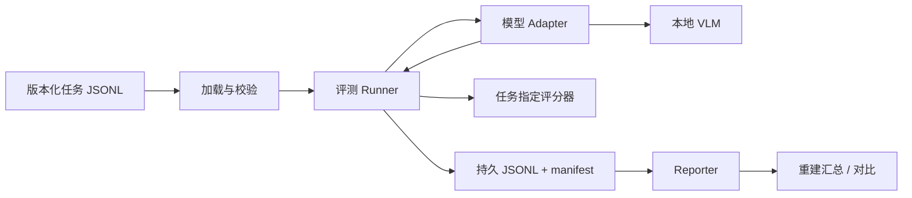

# OpenMultimodalLab

[](https://github.com/AlbertXXuu/OpenMultimodalLab/actions/workflows/ci.yml)

[](LICENSE)

[English](README.md)

一个本地优先、强调可复现证据的多模态模型评测工具。它要回答的不是“哪个
模型最热门”，而是：**在这组任务和这台硬件上，哪个视觉语言模型更合适，
这个结论能否被复核？**

OpenMultimodalLab 用统一 Adapter 运行版本化任务，把每次输出和失败写入
JSONL，按任务选择确定性评分规则，并记录模型、环境、输入哈希和性能边界，
从而不用重新推理也能重建报告。

> 当前为发布前开发阶段。图片、文档、表格和图表任务、两个真实本地模型、
> 正式性能协议、严格断点续跑、有限重试、协作式推理截止时间和 CI 质量门
> 已经可用。新的文档任务尚未完成真实模型正式对比；短视频仍属于路线图。

## 第一份可复现双模型结果

硬件为 NVIDIA RTX 4060 Laptop GPU（8,188 MiB）。两个模型使用相同的 10
条项目自制任务、相同干净 Git 提交、1 次 warm-up、3 次正式重复、贪心解码
和 batch size 1：

| 模型 | 平均任务得分 | 中位 TTFT | 中位任务延迟 | 峰值已分配显存 | 运行失败 |
|---|---:|---:|---:|---:|---:|
| Qwen3-VL-2B | 1.000 | 107.4 ms | 182.8 ms | 4,093.3 MiB | 0/30 |
| SmolVLM2-500M | 0.733 | 257.6 ms | 386.7 ms | 1,265.3 MiB | 0/30 |

这是资源与质量权衡，不是通用排行榜。SmolVLM2 峰值已分配显存约低 69%，
Qwen 在这组任务上回答更完整且中位延迟更低。两者参数规模和原生视觉处理器
不同，10 条英文合成任务也不能代表广泛真实能力。



完整解释见
[正式对比报告](docs/reports/2026-07-31-qwen3-vl-vs-smolvlm2.md)，原始
[Qwen JSONL](docs/reports/results/2026-07-31-qwen3-vl-comparison-formal.jsonl)
与
[SmolVLM2 JSONL](docs/reports/results/2026-07-31-smolvlm2-500m-comparison-formal.jsonl)
也保留在仓库中。

## 已实现能力

- 零第三方依赖核心和用于离线 CI 的确定性 `mock` 后端。
- Qwen3-VL-2B 与 SmolVLM2-500M 两个真实 Transformers 后端。
- 固定模型 revision，并记录原生 processor 与 chat template。
- 严格校验的版本化 UTF-8 JSONL 任务和许可证清晰的生成媒体。
- 通过向后兼容的任务 Schema 1.0–1.2 支持精确匹配、数值容差、关键词覆盖
  和可排序属性组评分。
- `synthetic-docs-v1`：32 条许可证清晰的任务，覆盖 8 张可复现生成的 OCR、
  键值、表格、柱状图和折线图图片。
- warm-up、重复测量、CUDA 同步 TTFT、生成速度、预处理和峰值显存。
- 可区分的模型加载、超时、OOM、生成和评分失败。
- Run record schema 0.4 持久化调用序号、终止/可重试状态、累计延迟、重试策略
  和协作式截止时间。
- 严格 `--resume`、显式 `--overwrite`、SHA-256 和原子检查点。
- 后端感知 `doctor` 检查 Python、CUDA、BF16、可选包和工作/模型缓存磁盘
  空间，但不打印缓存路径。
- Python 3.11/3.12 Linux CI、wheel 构建、仓库审计和离线测试集。

## 架构



推理与报告严格分离。图表和汇总是派生产物，逐任务原始证据才是事实来源。

## 五分钟核心快速开始

核心路径不会下载模型，可在 Python 3.11、3.12 或 3.13 运行：

```powershell
git clone https://github.com/AlbertXXuu/OpenMultimodalLab.git
cd OpenMultimodalLab

py -3.11 -m venv .venv
.\.venv\Scripts\python.exe -m pip install -e .

.\.venv\Scripts\oml.exe doctor
.\.venv\Scripts\oml.exe run `
  --dataset examples/tasks/smoke.jsonl `
  --output runs/smoke-001.jsonl
.\.venv\Scripts\oml.exe report `
  --input runs/smoke-001.jsonl
.\.venv\Scripts\python.exe -m unittest discover -s tests -v
```

Linux 使用同一组 CLI 参数，只需改为 `.venv/bin/python` 和
`.venv/bin/oml`。

`mock` 只验证基础设施，不能用它的得分描述真实模型能力。

## 运行真实本地模型

真实模型建议使用独立 Python 3.11/3.12 环境。先按硬件安装 CUDA 版
PyTorch，再安装项目 extra；当系统能看到 NVIDIA GPU 但 PyTorch 是 CPU
版本时，`doctor` 会明确拒绝。

- [Qwen3-VL 安装和已验证 Windows 配置](docs/backends/qwen3-vl.md)
- [SmolVLM2 安装和已验证配置](docs/backends/smolvlm2.md)

Qwen 环境准备完成后的正式命令：

```powershell
.\.venv-ml\Scripts\oml.exe doctor --backend qwen3-vl

.\.venv-ml\Scripts\oml.exe run `
  --backend qwen3-vl `
  --dataset examples/tasks/synthetic-v1.1.jsonl `
  --warmup 1 `
  --repetitions 3 `
  --max-new-tokens 64 `
  --output runs/qwen3-vl-formal-001.jsonl
```

首次运行会把固定 revision 的模型下载到 Hugging Face 用户缓存；权重和
本地 `runs/` 不进入 Git。

## 安全输出与中断恢复

`oml run` 默认拒绝覆盖已有 JSONL 或 manifest。兼容运行中断后，重复原命令
并加 `--resume`：

```powershell
.\.venv-ml\Scripts\oml.exe run `
  --backend qwen3-vl `
  --dataset examples/tasks/synthetic-v1.1.jsonl `
  --warmup 1 `
  --repetitions 3 `
  --max-new-tokens 64 `
  --output runs/qwen3-vl-formal-001.jsonl `
  --resume
```

追加前会核对数据/媒体哈希、任务顺序、模型 revision、生成参数、环境、
Git 状态、输出哈希与大小、记录数和严格尝试前缀。只有明确要替换旧证据时
才使用 `--overwrite`。

[严格恢复报告](docs/reports/2026-07-31-resumable-runs.md)说明了崩溃一致性
边界和故障注入证据。

长时间本地运行可以显式设置有限重试和超时策略：

```powershell
.\.venv-ml\Scripts\oml.exe run `
  --backend qwen3-vl `
  --dataset examples/tasks/synthetic-docs-v1.jsonl `
  --attempt-timeout-seconds 120 `
  --max-retries 1 `
  --output runs/qwen3-vl-docs-001.jsonl
```

只有 `timeout` 与 `generation_error` 会重试；输入错误、模型加载失败和 OOM
直接终止。内置模型的截止时间是协作式的，从一次性模型加载完成后开始计算；
它能约束预处理与 Transformers 生成，但不能安全地强制中断正在运行的 CUDA
内核。

## 可复现协议

可发布实验必须：

1. 固定任务和模型 revision；
2. 保留原 prompt 和语义一致的媒体；
3. 使用确定性解码和 batch size 1；
4. 至少 1 次 warm-up、3 次正式重复；
5. 不删除慢样本或失败样本；
6. 发布原始 JSONL、manifest、指标定义和限制。

[评测协议](docs/evaluation-protocol.md)给出计时与比较边界。不同 tokenizer
的 token/s 不被假装成完全等价指标。

## 证据与文档

| 主题 | 文档 |
|---|---|
| 项目目标和验收标准 | [目标](docs/01-goals-and-success.md) |
| 范围和需求 | [范围](docs/02-scope-and-requirements.md) |
| 系统设计 | [架构](docs/03-architecture.md) |
| 实验规则 | [评测协议](docs/evaluation-protocol.md) |
| 运行记录、manifest 和恢复 | [产物契约](docs/run-records-and-manifests.md) |
| 双模型正式结果 | [Qwen3-VL vs SmolVLM2](docs/reports/2026-07-31-qwen3-vl-vs-smolvlm2.md) |
| 性能方法 | [Qwen 正式性能基线](docs/reports/2026-07-31-qwen3-vl-formal-performance.md) |
| 质量与公开门槛 | [质量标准](docs/06-quality-and-open-source.md) |
| 全新 wheel 安装 | [Windows 审计与永久 CI 门禁](docs/reports/2026-08-01-fresh-wheel-install.md) |
| 依赖供应链 | [Action 固定与更新审计](docs/reports/2026-08-01-supply-chain-audit.md) |
| 文档、表格与图表任务集 | [`synthetic-docs-v1` 证据报告](docs/reports/2026-08-01-synthetic-docs-v1.md) |
| 超时与重试溯源 | [Run record schema 0.4 报告](docs/reports/2026-08-01-run-record-0.4.md) |
| 第一份完整实验 | [分步教程（英文）](docs/tutorials/first-reproducible-benchmark.md) |
| 当前工作 | [任务清单](TASKS.md) |
| 第三方许可证 | [Third-party notices](THIRD_PARTY_NOTICES.md) |

## 当前状态

| 领域 | 当前事实 |
|---|---|
| 真实图片后端 | Qwen3-VL-2B、SmolVLM2-500M 已在本机验证 |
| 当前版本化任务集 | 42 条任务、18 张许可证清晰且可确定生成的图片 |
| 已发布真实模型对比 | 使用 10 条合成图片任务；新文档任务尚未正式评测 |
| 性能协议 | warm-up、三次重复、TTFT、吞吐、延迟、峰值显存 |
| 可靠性 | 逐条持久化、严格恢复、完整性哈希、失败分类 |
| 自动质量 | 离线测试、Python 3.11/3.12 CI、仓库审计、全新 wheel 冒烟测试 |
| 下一阶段 | 在文档任务上做正式模型运行，然后制作短视频任务 |

目标是至少 100 条人工检查任务，覆盖图片、文档、图表、空间和短视频。当前
没有把这个目标标记为已经完成。

## 贡献

优先接受小型、可测试、能改善可复现性的贡献。新增模型时需要提供精确
revision、许可证、安装路径、已验证硬件、Adapter 契约测试和限制。

```powershell
.\.venv\Scripts\python.exe -m unittest discover -s tests -v
.\.venv\Scripts\python.exe scripts/check_repository.py
```

完整要求见 [CONTRIBUTING.md](CONTRIBUTING.md)。
安全漏洞按 [SECURITY.md](SECURITY.md) 建立私密渠道，不在公开 Bug 中粘贴
敏感细节。

## 许可证

项目代码和项目生成合成媒体采用 Apache-2.0。模型权重和可选运行依赖保留
各自许可证，不在本仓库分发。详见
[THIRD_PARTY_NOTICES.md](THIRD_PARTY_NOTICES.md)。

项目不承诺 Star 数，也不会把计划中的用户写成真实采用。可复现证据、可用
文档和外部反馈才是有效指标。
