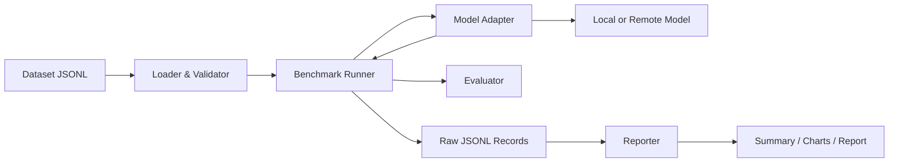

# 技术架构

## 1. 总体结构



核心原则：**运行和报告分离**。报告代码不能影响推理计时，原始结果也不能只存在于图表中。

## 2. 模块职责

| 模块 | 职责 |
|---|---|
| `datasets` | 加载、校验和版本化任务 |
| `adapters` | 隔离不同模型的加载与生成接口 |
| `runner` | 调度任务、计时、捕获异常、写原始记录 |
| `metrics` | 对单条响应评分 |
| `reporting` | 从原始记录计算汇总指标 |
| `cli` | 提供稳定的用户入口 |

## 3. Adapter 边界

第一阶段接口概念：

```python
class ModelAdapter(Protocol):
    name: str

    def generate(self, task: EvaluationTask) -> ModelOutput:
        ...
```

真实后端后续还需要：

- 显式的模型 revision；
- 设备、量化和 dtype；
- 生成参数；
- token 计数；
- 资源释放；
- 可区分的加载时间与生成时间。

## 4. 数据流

1. Loader 逐行解析 JSONL。
2. Validator 检查字段、重复 ID 和媒体路径。
3. Runner 将任务交给 Adapter。
4. Runner 单独测量每次生成时间。
5. Evaluator 根据任务指定规则评分。
6. 每条任务立即追加到原始 JSONL。
7. Reporter 离线读取原始记录并生成汇总。

## 5. 失败模型

每条运行记录必须处于以下状态之一：

- `success`
- `invalid_task`
- `missing_media`
- `model_load_error`
- `timeout`
- `out_of_memory`
- `generation_error`
- `evaluation_error`

当前基础版本只实现通用异常记录，接入真实模型时再增加可识别的 OOM 和超时分类。

## 6. 计划中的仓库结构

```text
OpenMultimodalLab/
├── .github/workflows/
├── docs/
├── examples/
│   ├── assets/
│   └── tasks/
├── src/openmultimodal_lab/
│   ├── adapters/
│   ├── cli.py
│   ├── datasets.py
│   ├── metrics.py
│   ├── models.py
│   ├── reporting.py
│   └── runner.py
├── tests/
├── TASKS.md
├── CONTRIBUTING.md
├── README.md
└── pyproject.toml
```

## 7. 技术选择

第一阶段：

- Python 3.11/3.12 作为正式支持版本。
- 标准库完成核心闭环，减少启动依赖。
- JSONL 保存逐样本原始结果。
- `unittest` 完成离线基础测试。
- GitHub Actions 执行 Python 3.11/3.12 CI。

后续候选：

- PyTorch、Transformers 和特定推理后端。
- Pydantic 用于稳定 schema。
- Polars/Pandas 用于分析。
- FastAPI + React/TypeScript 用于 Web Demo。

只有在真实需求出现后才添加依赖。
