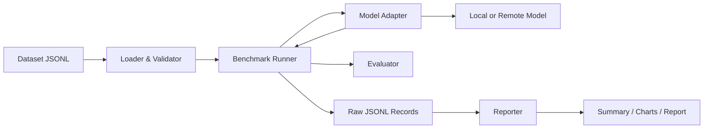

# 技术架构

## 1. 总体结构



核心原则：**运行和报告分离**。报告代码不能影响推理计时，原始结果也不能只存在于图表中。

## 2. 模块职责

| 模块 | 职责 |
|---|---|
| `datasets` | 加载、校验和版本化任务 |
| `adapters` | 隔离不同模型的加载与生成接口 |
| `runner` | 调度任务、计时、捕获异常、写原始记录 |
| `metrics` | 对单条响应评分 |
| `reporting` | 从原始记录计算汇总指标 |
| `report_bundle` | 校验正式结果/manifest，并重建可自校验的多模型报告包 |
| `cli` | 提供稳定的用户入口 |

## 3. Adapter 边界

第一阶段接口概念：

```python
class ModelAdapter(Protocol):
    name: str

    def generate(self, task: EvaluationTask) -> ModelOutput:
        ...
```

真实后端当前记录：

- 显式的模型 revision；
- 设备、量化和 dtype；
- 生成参数；
- token 计数；
- 可区分的模型加载、媒体读取、预处理、TTFT、生成和文本解码时间；
- 生成吞吐和峰值 CUDA 已分配显存。

Qwen3-VL 与 SmolVLM2 通过共享的 `TransformersImageTextAdapter` 执行
媒体加载、原生 chat template、确定性生成、CUDA 同步、计时、显存记录、
输出切片和资源释放。模型文件、固定 revision、依赖提示与加载 dtype 留在
各自的轻量子类中，避免复制测量逻辑后产生口径漂移。

## 4. 数据流

1. Loader 逐行解析 JSONL。
2. Validator 检查字段、重复 ID 和媒体路径。
3. Runner 将任务交给 Adapter。
4. Runner 先执行可审计但不计分的 warm-up，再按固定顺序重复正式任务。
5. Evaluator 根据任务指定规则评分。
6. 每次生成调用立即追加并同步到磁盘，再原子更新包含记录数和输出哈希的
   `started` checkpoint；可重试失败先落盘，再开始下一次调用。
7. 中断恢复前验证 manifest、输出哈希和现有记录是否为执行计划的严格前缀，
   包括调用序号、终止状态、重试策略和累计延迟，只追加缺失调用。
8. Reporter 排除 warm-up，从正式记录重建质量与性能汇总。
9. 运行清单保存输入哈希、模型、环境、Git 状态、计时协议、输出字节数和
   SHA-256。

## 5. 失败模型

每条运行记录必须处于以下状态之一：

- `success`
- `invalid_task`
- `missing_media`
- `model_load_error`
- `timeout`
- `out_of_memory`
- `generation_error`
- `evaluation_error`

当前已区分模型加载、协作式超时、OOM、通用生成和评分失败。只有超时和通用
生成失败可以在显式有限预算内重试；其他失败直接终止，避免无意义重复。

## 6. 当前仓库结构

```text
OpenMultimodalLab/
├── .github/workflows/
├── docs/
├── examples/
│   ├── assets/
│   └── tasks/
├── src/openmultimodal_lab/
│   ├── adapters/
│   ├── cli.py
│   ├── datasets.py
│   ├── metrics.py
│   ├── models.py
│   ├── report_bundle.py
│   ├── reporting.py
│   └── runner.py
├── tests/
├── TASKS.md
├── CONTRIBUTING.md
├── README.md
└── pyproject.toml
```

## 7. 技术选择

第一阶段：

- Python 3.11/3.12 作为正式支持版本。
- 标准库完成核心闭环，减少启动依赖。
- JSONL 保存逐样本原始结果。
- `unittest` 完成离线基础测试。
- GitHub Actions 执行 Python 3.11/3.12 CI。

后续候选：

- PyTorch、Transformers 和特定推理后端。
- Pydantic 用于稳定 schema。
- Polars/Pandas 用于分析。
- FastAPI + React/TypeScript 用于 Web Demo。

只有在真实需求出现后才添加依赖。
