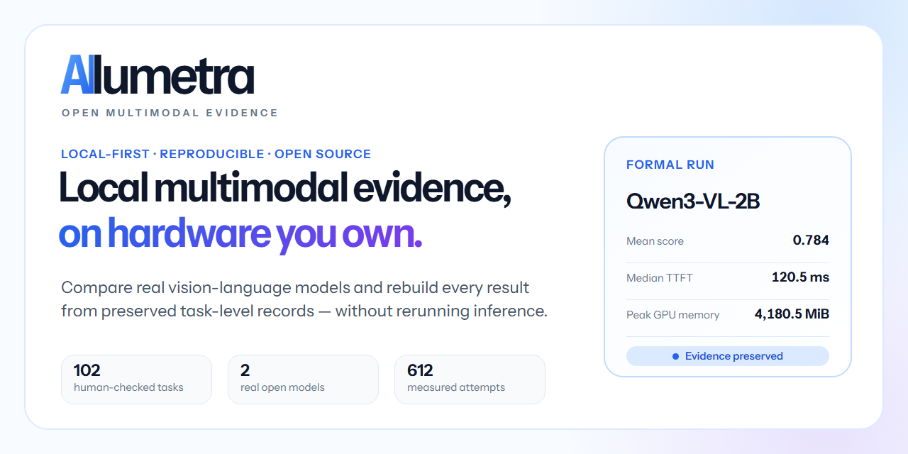

# Ailumetra launch kit

This directory contains truthful, reusable launch copy for the first external
feedback cycle. It is preparation material, not evidence that any post was
published or that any channel adopted the project.

Rebuild the preview with `python scripts/build_social_preview.py`. The script
uses the vendored Instrument Sans payload and a local Chromium-family browser;
the committed PNG is 1280×640 and remains below GitHub's 1 MB limit.

## Goal

Move from author-only validation to five independent, documented first runs.
The primary signal is a completed install/run/report workflow plus one concrete
piece of feedback. Stars, views, and impressions are secondary discovery
signals, not proof that the software works for another person.

## Recommended sequence

1. Finish GitHub discovery surfaces: social preview, profile pin, Discussions,
   and one canonical announcement.
2. Publish the Chinese technical introduction on CSDN or Juejin and link back
   to the canonical GitHub discussion.
3. Publish the LocalLLaMA draft, respond to setup questions, and turn genuine
   blockers into issues.
4. Wait at least several days, fix verified onboarding defects, then decide
   whether the project is ready for Show HN.
5. Stop broad promotion if visitors do not reach the quick start. Improve the
   first five minutes before adding more channels.

## Measurement

Record only observable results once per week:

- unique GitHub visitors and clones, with the warning that clones may include
  automation;
- completed external runs confirmed by an issue, discussion, or reproducible
  report;
- install failures and time to first successful report;
- questions that recur across at least two independent users;
- stars and forks as discovery context only.

Do not identify a visitor as a user, treat a clone as a successful install, or
write planned feedback as though it already happened.

## Drafts

- [GitHub Discussions announcement](github-discussion.md)
- [Reddit / LocalLLaMA post](reddit-localllama.md)
- [Show HN submission](show-hn.md)
- [Chinese technical introduction](zh-technical-introduction.md)

Every draft must be re-read against the current `main` branch before posting.
External posting remains an owner decision.
