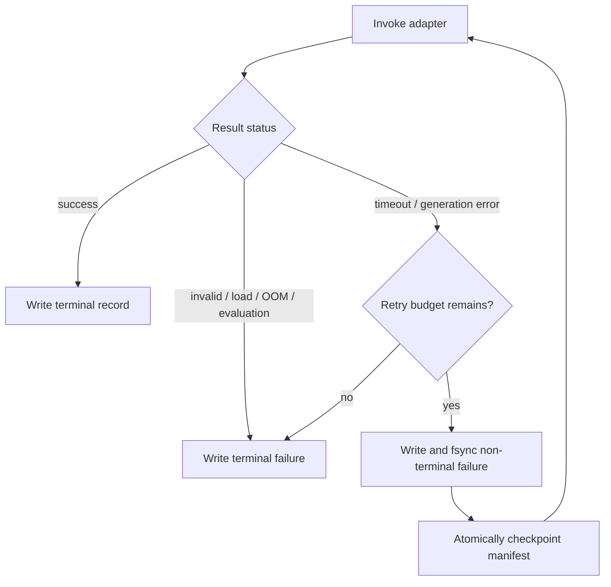

# Run record schema 0.4: durable timeout and retry provenance

Date: 2026-08-01

## Outcome

OpenMultimodalLab can now apply an explicit cooperative inference deadline and
a bounded retry budget without hiding transient failures. Every generation
invocation is flushed and synced before the next retry starts, and strict
resume can continue an interrupted retry chain at the correct invocation.

The feature is opt-in. Existing commands keep `max_retries: 0` and no timeout.
Old 0.1–0.3 result files remain reportable, but strict resume never mixes old
and new row schemas. An interrupted 0.3 run therefore needs its original code
revision or a fresh 0.4 output path.

## Why version 0.4

Run record 0.3 represented one row per scheduled task/repetition. Retrying
inside that row would lose the failed invocation on a process interruption and
would make latency provenance ambiguous. Schema 0.4 adds:

- `attempt_index`: one-based invocation number within the scheduled task;
- `terminal`: whether this row completes the scheduled task;
- `retryable`: whether the status belongs to the retryable class;
- `cumulative_latency_ms`: cost of the retry chain so far;
- `timeout_seconds` and `max_retries`: policy copied into every raw row.

Task schemas and run-record schemas describe different contracts. Task schema
1.2 remains unchanged; this release only changes runtime evidence.

## State machine



There is no retry backoff in 0.4. The local backends do not make network API
requests, and adding an undocumented delay would distort task latency. A later
policy can add backoff as a separately versioned contract if evidence requires
it.

## Reporter semantics

- `Records` and `Generation invocations` count every JSONL row.
- `Retry attempts` count non-terminal rows.
- `Timeout invocations` count every `status: "timeout"` row.
- Warm-up and measurement denominators use terminal rows only.
- A recovered failure does not become a terminal model failure, but remains
  visible in retry and timeout counts.
- Task latency uses the terminal row's cumulative latency.
- Any actual retry makes `formal_performance_run` false because the final row's
  GPU/token usage fields do not cover the complete retry chain.

## Timeout boundary and safety

The built-in Qwen3-VL and SmolVLM2 adapters implement the same cooperative
boundary:

1. load the model once outside the deadline;
2. start the deadline before media loading and preprocessing;
3. pass the remaining budget to Transformers `model.generate(max_time=...)`;
4. check the deadline after synchronized generation and text decoding;
5. raise the typed `timeout` status if the budget was crossed.

This is deliberately not implemented with a timed-out background thread.
Python cannot safely kill a thread executing a CUDA kernel, and retrying while
that thread continues could corrupt performance evidence or exhaust memory.
Transformers checks `max_time` between generation steps, so a long individual
kernel may finish after the nominal deadline. Model loading is also not
preempted.

Custom adapters must accept `timeout_seconds` and enforce it cooperatively when
the CLI timeout option is used.

## Retry and recovery invariants

- Only `generation_error` and `timeout` are retryable.
- Total invocations per scheduled task are at most `max_retries + 1`.
- A non-terminal record must be retryable and have budget remaining.
- Attempt indexes are consecutive and reset for each phase/repetition/task.
- Cumulative latency equals the prior cumulative value plus this invocation.
- Resume rejects changes to timeout, retry count, backend, model, task plan, or
  any existing invocation state.
- If interruption occurs after a retryable row is durable, resume continues at
  its next invocation index.

## Verification

Failure-injection tests cover:

- transient generation failure followed by success;
- typed timeout followed by success;
- retry exhaustion producing one terminal task failure;
- OOM remaining terminal even with retry budget;
- interruption between retries and continuation at attempt two;
- rejection of changed retry policy during resume;
- manifest invocation/retry counts and CLI policy capture;
- Transformers propagation of a positive remaining `max_time`.

The complete offline suite and repository audit remain the release gate. A
real-model timeout was not intentionally triggered in this change; doing so
would consume GPU time without strengthening the deterministic state-machine
proof. The next real document benchmark should use a generous recorded
deadline and report whether any invocation actually retried.

## Example

```powershell
.\.venv-ml\Scripts\oml.exe run `
  --backend qwen3-vl `
  --dataset examples/tasks/synthetic-docs-v1.jsonl `
  --warmup 1 `
  --repetitions 3 `
  --attempt-timeout-seconds 120 `
  --max-retries 1 `
  --output runs/qwen3-vl-docs-formal-001.jsonl
```

If no retry occurs and all other protocol fields are complete, the run can
still qualify as formal. If a retry occurs, keep the evidence and report the
quality result, but do not label its performance aggregate as formal.
