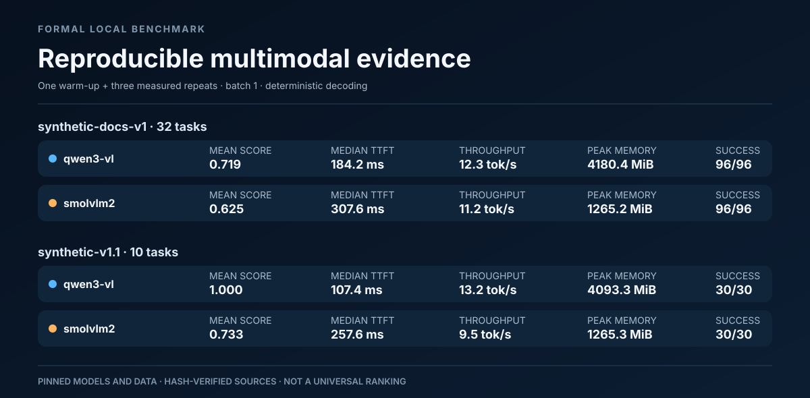

# Rebuilt formal multimodal benchmark report

This report was generated deterministically from preserved result JSONL and sidecar manifests. It did not rerun a model. Every source passed hash, dataset/media, clean-commit, model-identity, and formal-protocol validation before aggregation.

## Scope

- 2 model backends
- 2 SHA-bound evaluation inputs
- 2 retained dataset versions
- 42 unique dataset tasks
- exactly one successful warm-up followed by three complete measured repetitions per source
- batch size 1, deterministic decoding, no retries, and no model reloads during measurement



## Run summary

| Dataset | Backend | Tasks | Success | Mean score | Median TTFT | Median throughput | Peak GPU memory |
|---|---|---:|---:|---:|---:|---:|---:|
| synthetic-docs-v1 | `qwen3-vl` | 32 | 96/96 | 0.719 | 184.2 ms | 12.3 tok/s | 4180.4 MiB |
| synthetic-docs-v1 | `smolvlm2` | 32 | 96/96 | 0.625 | 307.6 ms | 11.2 tok/s | 1265.2 MiB |
| synthetic-v1.1 | `qwen3-vl` | 10 | 30/30 | 1.000 | 107.4 ms | 13.2 tok/s | 4093.3 MiB |
| synthetic-v1.1 | `smolvlm2` | 10 | 30/30 | 0.733 | 257.6 ms | 9.5 tok/s | 1265.3 MiB |

Detailed, machine-readable values are in `run-summary.csv`. Throughput uses each model's native tokenizer and is most reliable for repeated comparisons of the same pinned model.

## Category summary

| Dataset | Backend | Category | Tasks | Success | Mean score | Median TTFT | Peak GPU memory |
|---|---|---|---:|---:|---:|---:|---:|
| synthetic-docs-v1 | `qwen3-vl` | `chart-qa` | 8 | 24/24 | 0.625 | 185.1 ms | 4178.3 MiB |
| synthetic-docs-v1 | `qwen3-vl` | `document-key-value` | 10 | 30/30 | 0.900 | 185.5 ms | 4180.4 MiB |
| synthetic-docs-v1 | `qwen3-vl` | `document-ocr` | 6 | 18/18 | 0.833 | 178.7 ms | 4178.0 MiB |
| synthetic-docs-v1 | `qwen3-vl` | `table-qa` | 8 | 24/24 | 0.500 | 185.9 ms | 4179.8 MiB |
| synthetic-docs-v1 | `smolvlm2` | `chart-qa` | 8 | 24/24 | 0.375 | 308.5 ms | 1265.2 MiB |
| synthetic-docs-v1 | `smolvlm2` | `document-key-value` | 10 | 30/30 | 0.900 | 307.5 ms | 1265.2 MiB |
| synthetic-docs-v1 | `smolvlm2` | `document-ocr` | 6 | 18/18 | 1.000 | 309.0 ms | 1265.2 MiB |
| synthetic-docs-v1 | `smolvlm2` | `table-qa` | 8 | 24/24 | 0.250 | 307.0 ms | 1265.2 MiB |
| synthetic-v1.1 | `qwen3-vl` | `counting` | 3 | 9/9 | 1.000 | 106.0 ms | 4089.3 MiB |
| synthetic-v1.1 | `qwen3-vl` | `image-description` | 2 | 6/6 | 1.000 | 115.3 ms | 4092.4 MiB |
| synthetic-v1.1 | `qwen3-vl` | `spatial-reasoning` | 4 | 12/12 | 1.000 | 107.2 ms | 4093.3 MiB |
| synthetic-v1.1 | `qwen3-vl` | `visual-comparison` | 1 | 3/3 | 1.000 | 107.0 ms | 4090.1 MiB |
| synthetic-v1.1 | `smolvlm2` | `counting` | 3 | 9/9 | 1.000 | 256.7 ms | 1265.2 MiB |
| synthetic-v1.1 | `smolvlm2` | `image-description` | 2 | 6/6 | 0.500 | 257.1 ms | 1265.2 MiB |
| synthetic-v1.1 | `smolvlm2` | `spatial-reasoning` | 4 | 12/12 | 0.583 | 259.3 ms | 1265.3 MiB |
| synthetic-v1.1 | `smolvlm2` | `visual-comparison` | 1 | 3/3 | 1.000 | 257.4 ms | 1265.2 MiB |

## Failures

No failed measured attempts were recorded. `failures.csv` is still emitted with its stable schema so downstream automation does not need a special case.

## Preserved evidence

| Dataset | Backend | Result | Result SHA-256 | Manifest | Manifest SHA-256 |
|---|---|---|---|---|---|
| synthetic-docs-v1 | `qwen3-vl` | `docs/reports/results/2026-08-02-qwen3-vl-docs-formal.jsonl` | `1b0655ee19c1cd6c635a15d66abe90bc4f44bb06edda8e13efa808f27be2ac17` | `docs/reports/results/2026-08-02-qwen3-vl-docs-formal.manifest.json` | `38aee214b5288f14ac5e0bc8fbcf9f8cab9a332c93e6321b48485f8a1dfff60e` |
| synthetic-docs-v1 | `smolvlm2` | `docs/reports/results/2026-08-02-smolvlm2-500m-docs-formal.jsonl` | `63c979be02e3e99400c45b4ecf8d2ca797b5eaec0ff512b23fded5f7d50471df` | `docs/reports/results/2026-08-02-smolvlm2-500m-docs-formal.manifest.json` | `f61e5fa8c4690a97119e6185f82212c739a78604170100420e3f7186f8567b2a` |
| synthetic-v1.1 | `qwen3-vl` | `docs/reports/results/2026-07-31-qwen3-vl-comparison-formal.jsonl` | `bb3cd773a66b85713d221e632ce44d0d561950d6ede4ce9c8bb0ccacfd7e10ff` | `docs/reports/results/2026-07-31-qwen3-vl-comparison-formal.manifest.json` | `fe4f4ce01102cf572a61ad11c102d332609d8a374d6420d11d3205f05ffe5b0a` |
| synthetic-v1.1 | `smolvlm2` | `docs/reports/results/2026-07-31-smolvlm2-500m-comparison-formal.jsonl` | `841002994be8f733bab0cc9ca4e5627b4e0198145a84871bd1b61427086625ba` | `docs/reports/results/2026-07-31-smolvlm2-500m-comparison-formal.manifest.json` | `e367c63c7547fc398ab7c0a3196c17efb699e56f0c57ba1ba12469a0b45e28a8` |

## Rebuild

From the repository root:

```powershell
python scripts/build_benchmark_report.py `
  --input docs/reports/results/2026-08-02-qwen3-vl-docs-formal.jsonl `
  --input docs/reports/results/2026-08-02-smolvlm2-500m-docs-formal.jsonl `
  --input docs/reports/results/2026-07-31-qwen3-vl-comparison-formal.jsonl `
  --input docs/reports/results/2026-07-31-smolvlm2-500m-comparison-formal.jsonl `
  --output-dir <output-directory>
```

Then verify every source, output hash, generator hash, and the self-hashed build manifest:

```powershell
python scripts/build_benchmark_report.py `
  --verify `
  --output-dir <output-directory>
```

## Interpretation limits

These results apply only to the pinned models, task files, media hashes, software environments, and hardware recorded by the source manifests. They are not a universal model ranking and do not represent user preference or production quality.
