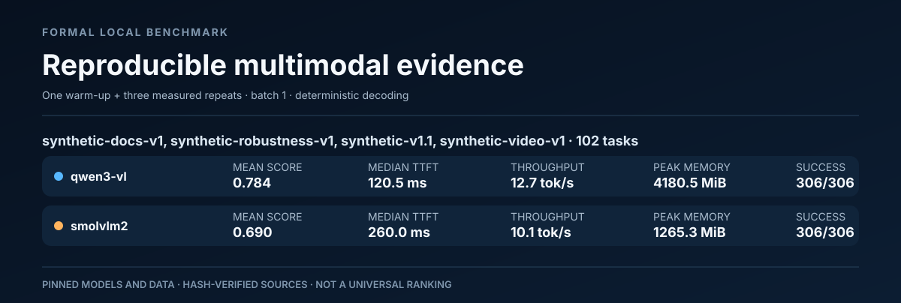

# 重建的正式多模态基准报告

[English](v1.0.0-candidate/report.md) · 简体中文

> 本文完整翻译冻结的 [`docs/reports/v1.0.0-candidate/report.md`](v1.0.0-candidate/report.md)，来源版本为 `5a31514dda9a43235e6073ed2ba6b0495c90657d`。译文置于证据包之外；可逐字节重建的英文原件、原始结果与清单为核验依据。模型、数据集和类别标识保持原样，便于对照机器可读结果。

本报告根据保存的结果 JSONL 及其配套清单，以确定性方式生成，没有重新运行模型。汇总前，每份来源均通过哈希、数据集与媒体、干净提交状态、模型身份和正式协议验证。

## 范围

- 2 个模型后端
- 1 份由 SHA 绑定的评测输入
- 4 个保留的数据集版本
- 102 个不同的数据集任务
- 每份来源均先完成且仅完成 1 次成功预热，再进行 3 轮完整的计量重复
- 批量大小为 1，采用确定性解码；计量期间不重试、不重新加载模型



## 运行汇总

| 数据集 | 后端 | 任务数 | 成功次数 | 平均得分 | 首 token 延迟（TTFT）中位数 | 吞吐量中位数 | GPU 显存峰值 |
|---|---|---:|---:|---:|---:|---:|---:|
| synthetic-docs-v1, synthetic-robustness-v1, synthetic-v1.1, synthetic-video-v1 | `qwen3-vl` | 102 | 306/306 | 0.784 | 120.5 ms | 12.7 tok/s | 4180.5 MiB |
| synthetic-docs-v1, synthetic-robustness-v1, synthetic-v1.1, synthetic-video-v1 | `smolvlm2` | 102 | 306/306 | 0.690 | 260.0 ms | 10.1 tok/s | 1265.3 MiB |

完整的机器可读数值见 [`run-summary.csv`](v1.0.0-candidate/run-summary.csv)。吞吐量使用各模型原生 tokenizer 计算，最适合比较同一固定版本模型的重复运行。

## 类别汇总

| 数据集 | 后端 | 类别标识 | 任务数 | 成功次数 | 平均得分 | TTFT 中位数 | GPU 显存峰值 |
|---|---|---|---:|---:|---:|---:|---:|
| synthetic-docs-v1, synthetic-robustness-v1, synthetic-v1.1, synthetic-video-v1 | `qwen3-vl` | `attribute-recognition` | 24 | 72/72 | 0.958 | 109.2 ms | 4089.5 MiB |
| synthetic-docs-v1, synthetic-robustness-v1, synthetic-v1.1, synthetic-video-v1 | `qwen3-vl` | `chart-qa` | 8 | 24/24 | 0.625 | 164.4 ms | 4179.4 MiB |
| synthetic-docs-v1, synthetic-robustness-v1, synthetic-v1.1, synthetic-video-v1 | `qwen3-vl` | `counting` | 6 | 18/18 | 1.000 | 105.5 ms | 4089.5 MiB |
| synthetic-docs-v1, synthetic-robustness-v1, synthetic-v1.1, synthetic-video-v1 | `qwen3-vl` | `document-key-value` | 10 | 30/30 | 0.900 | 165.9 ms | 4180.5 MiB |
| synthetic-docs-v1, synthetic-robustness-v1, synthetic-v1.1, synthetic-video-v1 | `qwen3-vl` | `document-ocr` | 6 | 18/18 | 0.833 | 172.7 ms | 4179.1 MiB |
| synthetic-docs-v1, synthetic-robustness-v1, synthetic-v1.1, synthetic-video-v1 | `qwen3-vl` | `event-order` | 4 | 12/12 | 0.000 | 100.5 ms | 4096.0 MiB |
| synthetic-docs-v1, synthetic-robustness-v1, synthetic-v1.1, synthetic-video-v1 | `qwen3-vl` | `image-description` | 2 | 6/6 | 1.000 | 110.1 ms | 4092.1 MiB |
| synthetic-docs-v1, synthetic-robustness-v1, synthetic-v1.1, synthetic-video-v1 | `qwen3-vl` | `motion-direction` | 4 | 12/12 | 0.500 | 95.6 ms | 4096.2 MiB |
| synthetic-docs-v1, synthetic-robustness-v1, synthetic-v1.1, synthetic-video-v1 | `qwen3-vl` | `occlusion-reasoning` | 3 | 9/9 | 0.667 | 108.6 ms | 4089.8 MiB |
| synthetic-docs-v1, synthetic-robustness-v1, synthetic-v1.1, synthetic-video-v1 | `qwen3-vl` | `spatial-reasoning` | 10 | 30/30 | 0.800 | 109.5 ms | 4093.4 MiB |
| synthetic-docs-v1, synthetic-robustness-v1, synthetic-v1.1, synthetic-video-v1 | `qwen3-vl` | `state-change` | 3 | 9/9 | 1.000 | 108.9 ms | 4097.3 MiB |
| synthetic-docs-v1, synthetic-robustness-v1, synthetic-v1.1, synthetic-video-v1 | `qwen3-vl` | `table-qa` | 8 | 24/24 | 0.500 | 167.5 ms | 4179.9 MiB |
| synthetic-docs-v1, synthetic-robustness-v1, synthetic-v1.1, synthetic-video-v1 | `qwen3-vl` | `temporal-counting` | 5 | 15/15 | 0.800 | 99.6 ms | 4097.5 MiB |
| synthetic-docs-v1, synthetic-robustness-v1, synthetic-v1.1, synthetic-video-v1 | `qwen3-vl` | `temporal-position` | 8 | 24/24 | 0.750 | 110.0 ms | 4097.3 MiB |
| synthetic-docs-v1, synthetic-robustness-v1, synthetic-v1.1, synthetic-video-v1 | `qwen3-vl` | `visual-comparison` | 1 | 3/3 | 1.000 | 117.8 ms | 4090.2 MiB |
| synthetic-docs-v1, synthetic-robustness-v1, synthetic-v1.1, synthetic-video-v1 | `smolvlm2` | `attribute-recognition` | 24 | 72/72 | 1.000 | 260.7 ms | 1265.2 MiB |
| synthetic-docs-v1, synthetic-robustness-v1, synthetic-v1.1, synthetic-video-v1 | `smolvlm2` | `chart-qa` | 8 | 24/24 | 0.375 | 264.2 ms | 1265.2 MiB |
| synthetic-docs-v1, synthetic-robustness-v1, synthetic-v1.1, synthetic-video-v1 | `smolvlm2` | `counting` | 6 | 18/18 | 1.000 | 261.0 ms | 1265.2 MiB |
| synthetic-docs-v1, synthetic-robustness-v1, synthetic-v1.1, synthetic-video-v1 | `smolvlm2` | `document-key-value` | 10 | 30/30 | 0.900 | 262.1 ms | 1265.2 MiB |
| synthetic-docs-v1, synthetic-robustness-v1, synthetic-v1.1, synthetic-video-v1 | `smolvlm2` | `document-ocr` | 6 | 18/18 | 1.000 | 264.6 ms | 1265.2 MiB |
| synthetic-docs-v1, synthetic-robustness-v1, synthetic-v1.1, synthetic-video-v1 | `smolvlm2` | `event-order` | 4 | 12/12 | 0.750 | 174.5 ms | 1177.3 MiB |
| synthetic-docs-v1, synthetic-robustness-v1, synthetic-v1.1, synthetic-video-v1 | `smolvlm2` | `image-description` | 2 | 6/6 | 0.500 | 262.3 ms | 1265.2 MiB |
| synthetic-docs-v1, synthetic-robustness-v1, synthetic-v1.1, synthetic-video-v1 | `smolvlm2` | `motion-direction` | 4 | 12/12 | 0.250 | 180.5 ms | 1177.3 MiB |
| synthetic-docs-v1, synthetic-robustness-v1, synthetic-v1.1, synthetic-video-v1 | `smolvlm2` | `occlusion-reasoning` | 3 | 9/9 | 0.333 | 261.3 ms | 1265.2 MiB |
| synthetic-docs-v1, synthetic-robustness-v1, synthetic-v1.1, synthetic-video-v1 | `smolvlm2` | `spatial-reasoning` | 10 | 30/30 | 0.533 | 264.0 ms | 1265.3 MiB |
| synthetic-docs-v1, synthetic-robustness-v1, synthetic-v1.1, synthetic-video-v1 | `smolvlm2` | `state-change` | 3 | 9/9 | 0.667 | 167.8 ms | 1177.3 MiB |
| synthetic-docs-v1, synthetic-robustness-v1, synthetic-v1.1, synthetic-video-v1 | `smolvlm2` | `table-qa` | 8 | 24/24 | 0.250 | 262.1 ms | 1265.2 MiB |
| synthetic-docs-v1, synthetic-robustness-v1, synthetic-v1.1, synthetic-video-v1 | `smolvlm2` | `temporal-counting` | 5 | 15/15 | 0.400 | 180.9 ms | 1177.3 MiB |
| synthetic-docs-v1, synthetic-robustness-v1, synthetic-v1.1, synthetic-video-v1 | `smolvlm2` | `temporal-position` | 8 | 24/24 | 0.500 | 173.1 ms | 1177.3 MiB |
| synthetic-docs-v1, synthetic-robustness-v1, synthetic-v1.1, synthetic-video-v1 | `smolvlm2` | `visual-comparison` | 1 | 3/3 | 1.000 | 267.8 ms | 1265.2 MiB |

## 失败记录

未记录到失败的计量尝试。仍按固定结构输出 [`failures.csv`](v1.0.0-candidate/failures.csv)，以便下游自动化按统一方式处理。

## 保存的证据

| 数据集 | 后端 | 结果文件 | 结果 SHA-256 | 清单 | 清单 SHA-256 |
|---|---|---|---|---|---|
| synthetic-docs-v1, synthetic-robustness-v1, synthetic-v1.1, synthetic-video-v1 | `qwen3-vl` | `docs/reports/results/2026-08-10-qwen3-vl-v1.0.0-formal.jsonl` | `a6574423770718fe20f7bd308d09fb8246ed9d0f71a70bd5b15138ff9c90908c` | `docs/reports/results/2026-08-10-qwen3-vl-v1.0.0-formal.manifest.json` | `7b73efc0dececc8d03f998040844ffd122284dd24745907035eb33c8c825cc78` |
| synthetic-docs-v1, synthetic-robustness-v1, synthetic-v1.1, synthetic-video-v1 | `smolvlm2` | `docs/reports/results/2026-08-10-smolvlm2-v1.0.0-formal.jsonl` | `b195dc43e7d0f719c02f819c4ffab8017dd905b74cd7981d4e39bf8527fdb027` | `docs/reports/results/2026-08-10-smolvlm2-v1.0.0-formal.manifest.json` | `cc2c3b4e66b2814475d39c292ce3aec874f0940dac0f5df978777bf6aae9bca9` |

## 重建

在仓库根目录执行：

```powershell
python scripts/build_benchmark_report.py `
  --input docs/reports/results/2026-08-10-qwen3-vl-v1.0.0-formal.jsonl `
  --input docs/reports/results/2026-08-10-smolvlm2-v1.0.0-formal.jsonl `
  --output-dir <output-directory>
```

然后验证全部来源、输出哈希、生成器哈希，以及包含自身哈希的构建清单：

```powershell
python scripts/build_benchmark_report.py `
  --verify `
  --output-dir <output-directory>
```

## 解释边界

这些结果仅适用于来源清单记录的固定模型、任务文件、媒体哈希、软件环境和硬件，不能视为普适模型排名，也不代表用户偏好或生产环境质量。
