# Review workbook: 42 image and document tasks

> Status: **owner review completed on 2026-08-14**. This worksheet remains a
> viewing aid; the machine-validated evidence is stored in the SHA-bound
> `synthetic-docs-v1.json` and `synthetic-v1.1.json` records beside it.

This worksheet covers the two v1.0.0 datasets whose earlier review evidence was
not recorded at the same task-by-task, SHA-bound level as the video and visual
robustness datasets:

| Dataset | Tasks | Original images | Dataset SHA-256 |
|---|---:|---:|---|
| `synthetic-docs-v1` | 32 | 8 | `79b9f2c25f2985b6ccbd6fba2e44d234685338534d3d810f4f2931eacdb9d610` |
| `synthetic-v1.1` | 10 | 10 | `682e4089fc2f9793209b40beb0026279bd0f58d3ec4fcf75d3f65abba88e4692` |

The package and existing GitHub Release remain `1.0.0`. The published
`v1.0.0` tag must not be moved or replaced.

## How to review

For every task, open the linked original image at full resolution and confirm
all five statements:

1. The media opens and renders correctly.
2. The relevant shapes, text, values, or relationships are clearly visible.
3. The stated reference answer agrees with the image.
4. The prompt and reference answer are not materially ambiguous.
5. The project-generated media and Apache-2.0 provenance recorded in the task
   agree with the repository.

If any statement is false, stop and report the task ID and the problem. Do not
approve the full dataset.

## `synthetic-docs-v1`: 32 tasks over 8 images

### 1. Receipt

[Open the original 768×512 image](../../examples/assets/synthetic-docs-v1/receipt-cafe.png)

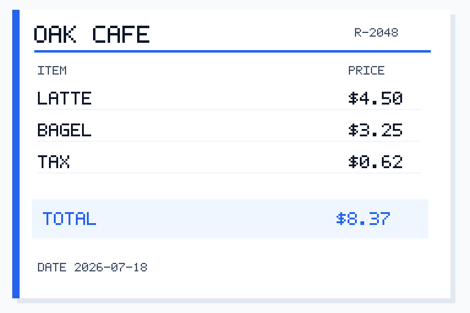

| Task ID | Prompt | Reference answer |
|---|---|---|
| `receipt-cafe-id` | Read the receipt number. Answer with the identifier only. | `R-2048` |
| `receipt-cafe-total` | What is the receipt total in dollars? Answer with one number only, without a currency symbol. | `8.37` |
| `receipt-cafe-date` | Read the receipt date. Answer in YYYY-MM-DD format only. | `2026-07-18` |
| `receipt-cafe-bagel-price` | What is the bagel price in dollars? Answer with one number only. | `3.25` |

### 2. Invoice

[Open the original 768×512 image](../../examples/assets/synthetic-docs-v1/invoice-studio.png)

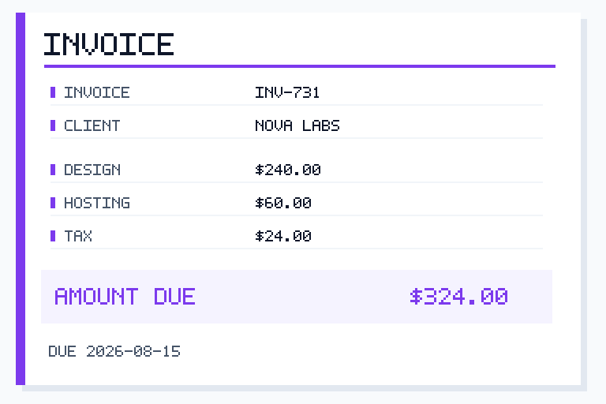

| Task ID | Prompt | Reference answer |
|---|---|---|
| `invoice-studio-number` | Read the invoice number. Answer with the identifier only. | `INV-731` |
| `invoice-studio-client` | Who is the invoice client? Answer with the client name only. | `NOVA LABS` |
| `invoice-studio-amount-due` | What amount is due in dollars? Answer with one number only. | `324.00` |
| `invoice-studio-due-date` | Read the invoice due date. Answer in YYYY-MM-DD format only. | `2026-08-15` |

### 3. Lab schedule

[Open the original 768×512 image](../../examples/assets/synthetic-docs-v1/schedule-lab.png)

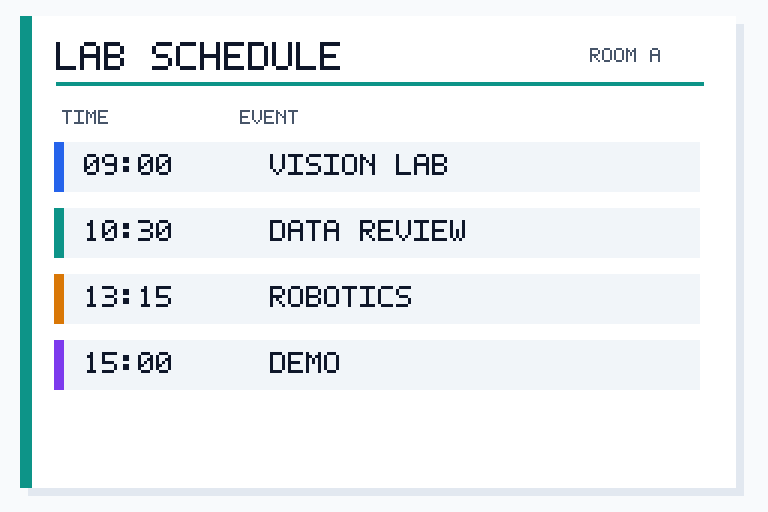

| Task ID | Prompt | Reference answer |
|---|---|---|
| `schedule-lab-1030-event` | Which event starts at 10:30? Answer with the event name only. | `DATA REVIEW` |
| `schedule-lab-robotics-time` | At what time does ROBOTICS start? Answer in HH:MM format only. | `13:15` |
| `schedule-lab-event-count` | How many events are listed? Answer with one number only. | `4` |
| `schedule-lab-last-event` | What is the last event in the schedule? Answer with the event name only. | `DEMO` |

### 4. Inventory table

[Open the original 768×512 image](../../examples/assets/synthetic-docs-v1/inventory-table.png)

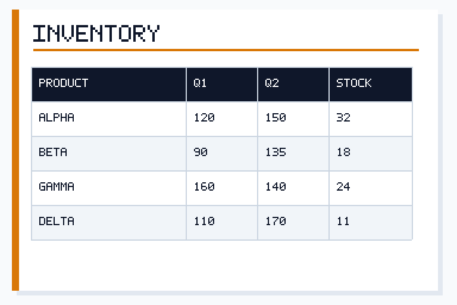

| Task ID | Prompt | Reference answer |
|---|---|---|
| `inventory-q2-maximum` | Which product has the highest Q2 value? Answer with the product name only. | `DELTA` |
| `inventory-beta-total` | Add BETA's Q1 and Q2 values. Answer with one number only. | `225` |
| `inventory-gamma-change` | Calculate GAMMA's Q2 minus Q1. Answer with one signed number only. | `-20` |
| `inventory-lowest-stock` | Which product has the lowest stock? Answer with the product name only. | `DELTA` |

### 5. Regional sales chart

[Open the original 768×512 image](../../examples/assets/synthetic-docs-v1/sales-bar-chart.png)

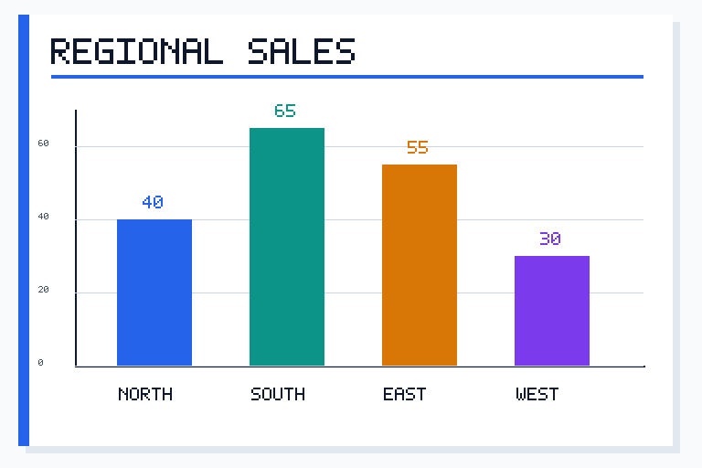

| Task ID | Prompt | Reference answer |
|---|---|---|
| `sales-region-maximum` | Which region has the highest sales? Answer with the region name only. | `SOUTH` |
| `sales-west-value` | What is the WEST sales value? Answer with one number only. | `30` |
| `sales-south-west-gap` | Calculate SOUTH sales minus WEST sales. Answer with one number only. | `35` |
| `sales-total` | Add the sales values for all four regions. Answer with one number only. | `190` |

### 6. Daily traffic chart

[Open the original 768×512 image](../../examples/assets/synthetic-docs-v1/traffic-line-chart.png)

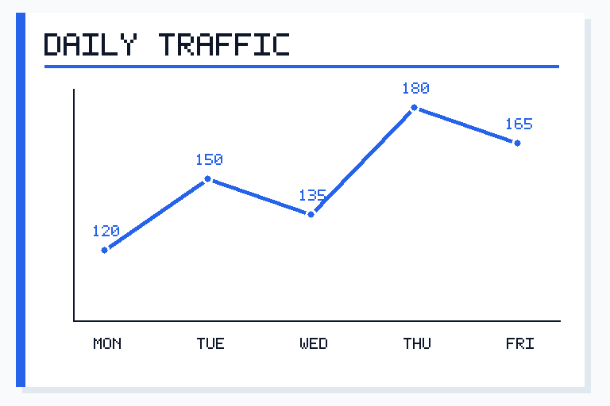

| Task ID | Prompt | Reference answer |
|---|---|---|
| `traffic-peak-day` | Which day has the highest traffic? Answer with the three-letter day only. | `THU` |
| `traffic-wed-value` | What is the WED traffic value? Answer with one number only. | `135` |
| `traffic-mon-thu-rise` | Calculate THU traffic minus MON traffic. Answer with one number only. | `60` |
| `traffic-weekday-average` | Calculate the mean traffic across all five days. Answer with one number only. | `150` |

### 7. Project status

[Open the original 768×512 image](../../examples/assets/synthetic-docs-v1/project-status.png)

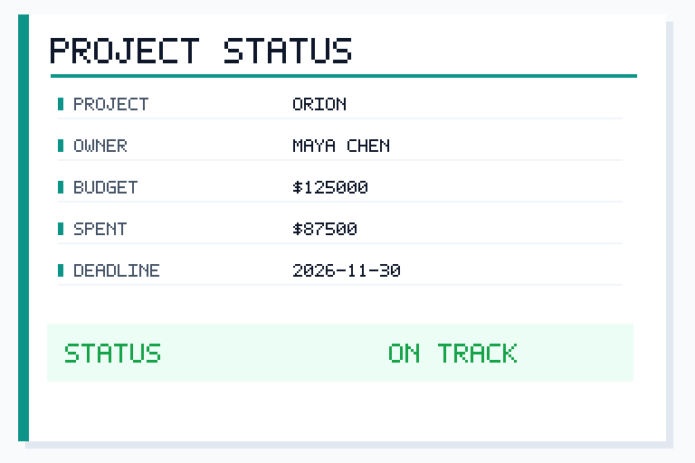

| Task ID | Prompt | Reference answer |
|---|---|---|
| `project-status-owner` | Who owns PROJECT ORION? Answer with the owner name only. | `MAYA CHEN` |
| `project-status-value` | What is the project status? Answer with the status text only. | `ON TRACK` |
| `project-status-remaining-budget` | Calculate budget minus spent. Answer with one number only, without a currency symbol. | `37500` |
| `project-status-deadline` | Read the project deadline. Answer in YYYY-MM-DD format only. | `2026-11-30` |

### 8. Energy output table

[Open the original 768×512 image](../../examples/assets/synthetic-docs-v1/energy-table.png)

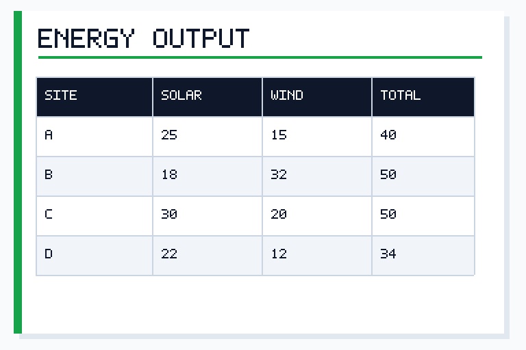

| Task ID | Prompt | Reference answer |
|---|---|---|
| `energy-highest-wind-site` | Which site has the highest WIND value? Answer with the site letter only. | `B` |
| `energy-sites-bc-total` | Add the TOTAL values for sites B and C. Answer with one number only. | `100` |
| `energy-site-d-total` | What is site D's TOTAL value? Answer with one number only. | `34` |
| `energy-highest-solar-site` | Which site has the highest SOLAR value? Answer with the site letter only. | `C` |

## `synthetic-v1.1`: 10 tasks over 10 images

### 9. Basic shapes

[Open original](../../examples/assets/synthetic-v1/shapes-basic-001.png)

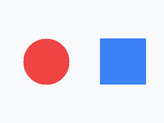

- `shapes-basic-001` — Describe the two colored shapes. Mention each color
  and shape. Reference: **red circle; blue square**.

### 10. Above relationship

[Open original](../../examples/assets/synthetic-v1/spatial-above-001.png)

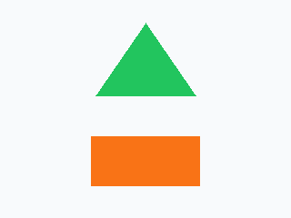

- `spatial-above-001` — Which object is above the other? Reference:
  **green triangle is above orange rectangle**.

### 11. Count purple circles

[Open original](../../examples/assets/synthetic-v1/counting-circles-001.png)

- `counting-circles-001` — How many purple circles are shown? Reference:
  **3**.

### 12. Count blue squares

[Open original](../../examples/assets/synthetic-v1/counting-squares-001.png)

- `counting-squares-001` — How many blue squares are shown? Reference:
  **5**.

### 13. Left/right relationship

[Open original](../../examples/assets/synthetic-v1/spatial-left-001.png)

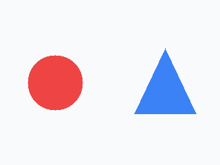

- `spatial-left-001` — Is the red circle to the left or right of the blue
  triangle? Reference: **left**.

### 14. Above/below relationship

[Open original](../../examples/assets/synthetic-v1/spatial-below-001.png)

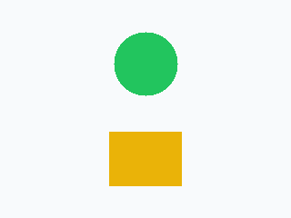

- `spatial-below-001` — Is the yellow square above or below the green circle?
  Reference: **below**.

### 15. Three shapes from left to right

[Open original](../../examples/assets/synthetic-v1/shapes-multi-001.png)

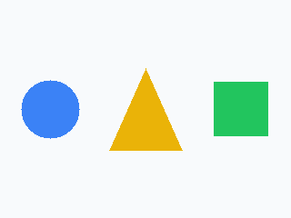

- `shapes-multi-001` — List the three colored shapes from left to right.
  Reference: **blue circle; yellow triangle; green square**.

### 16. Count orange rectangles

[Open original](../../examples/assets/synthetic-v1/counting-rectangles-001.png)

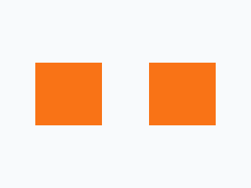

- `counting-rectangles-001` — How many orange rectangles are shown?
  Reference: **2**.

### 17. Between relationship

[Open original](../../examples/assets/synthetic-v1/spatial-between-001.png)

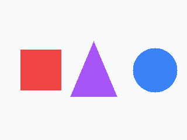

- `spatial-between-001` — Which colored shape is between the red square and
  the blue circle? Reference: **purple triangle**.

### 18. Size comparison

[Open original](../../examples/assets/synthetic-v1/comparison-size-001.png)

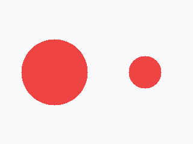

- `comparison-size-001` — Which side contains the larger red circle?
  Reference: **left**.

## Recorded reviewer confirmation

After inspecting the originals and all 42 tasks, the owner confirmed:

> I inspected all 8 original `synthetic-docs-v1` images and all 32 associated
> tasks, plus all 10 original `synthetic-v1.1` images and all 10 associated
> tasks. Every image opens correctly; the relevant content is clearly visible;
> every reference answer agrees with the image and is unambiguous; and the
> recorded license and provenance are consistent with the repository.
> Reviewer: AlbertXXuu. Date: 2026-08-14.

Any byte change to either dataset invalidates its recorded SHA-256 and requires
a new review.
